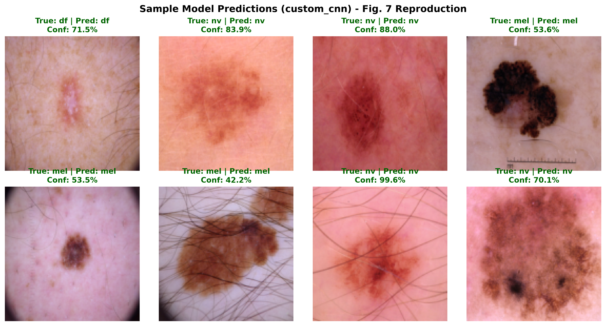
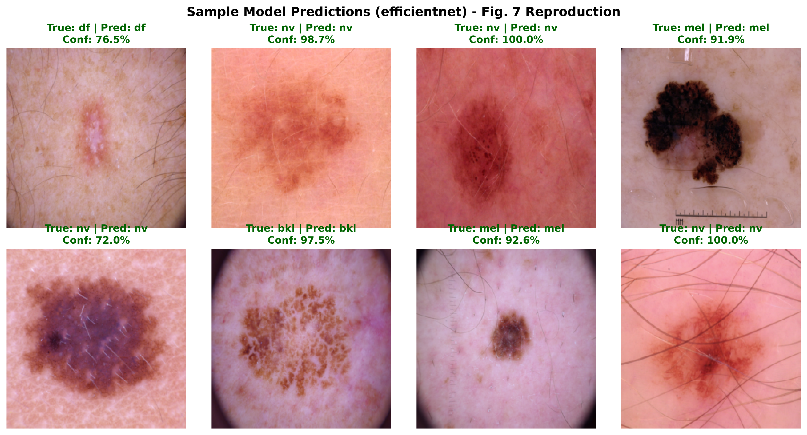
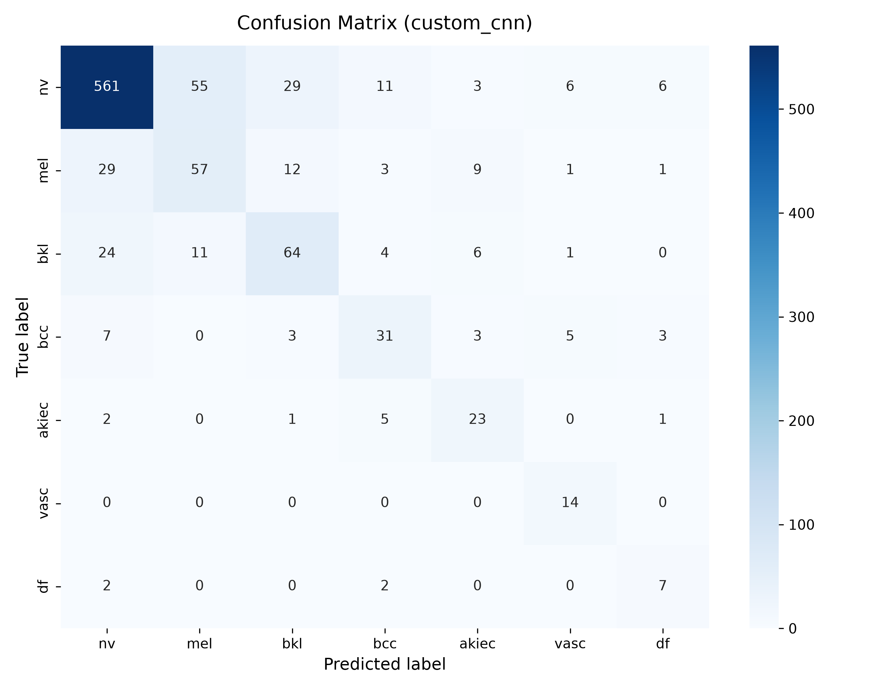
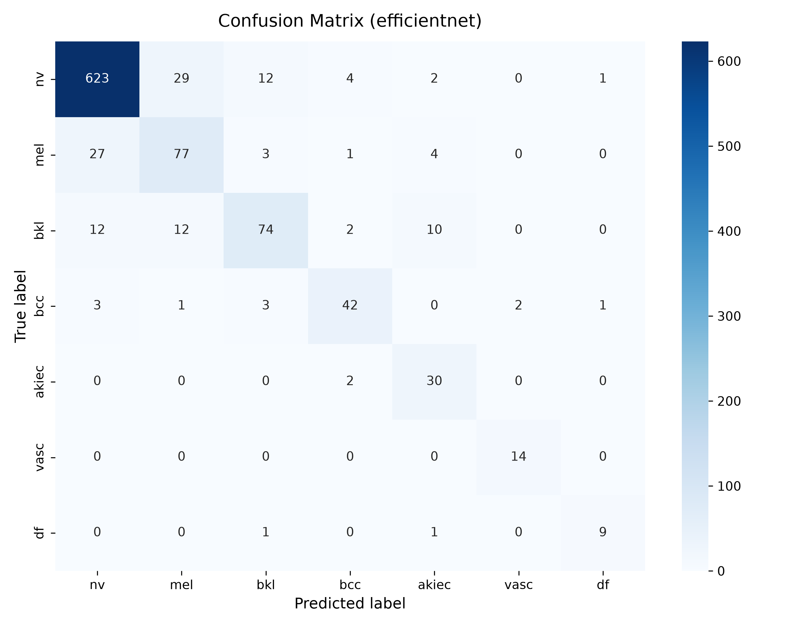
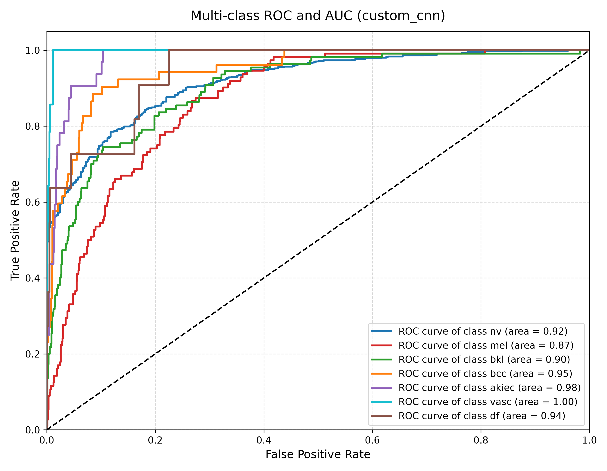
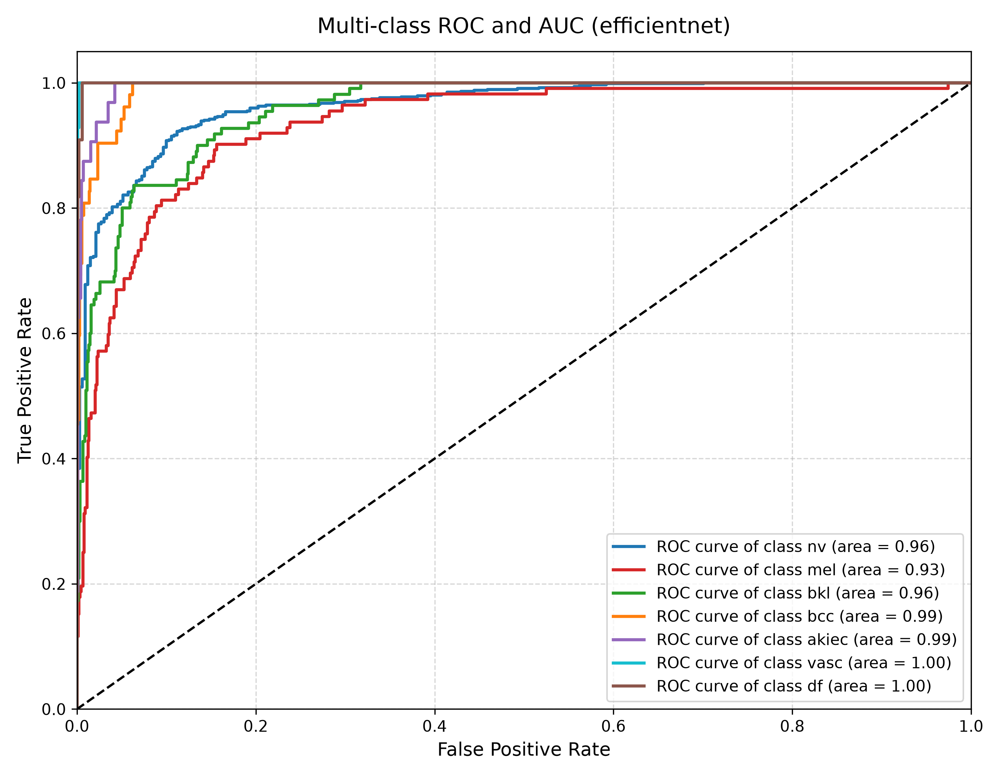
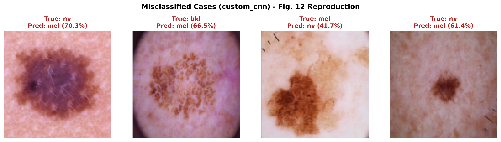

# Enhanced Skin Cancer Diagnosis: Custom CNN vs. EfficientNet-B0 (PyTorch)

An implementation and benchmark of deep learning architectures for dermatological lesion classification on the **HAM10000** dataset, based on and expanding upon:

> 📄 **Research Paper:**  
> [Enhanced skin cancer diagnosis using optimized CNN architecture and checkpoints for automated dermatological lesion classification](https://link.springer.com/article/10.1186/s12880-024-01356-8)  
> *M Mohamed Musthafa, Mahesh T R, Vinoth Kumar V, Suresh Guluwadi*  
> Published in **BMC Medical Imaging (2024) 24:201**, Springer Nature.  
> DOI: [10.1186/s12880-024-01356-8](https://doi.org/10.1186/s12880-024-01356-8)

---

## 📖 Paper Overview

Skin cancer is one of the most common malignancies globally, where early and accurate diagnosis plays a decisive role in patient survival. While dermatologists rely on visual inspection and dermoscopy, diagnosis can be subjective and access to specialists remains scarce in underserved areas.

This study investigates automated dermatological diagnosis using Convolutional Neural Networks on the **HAM10000** ("Human Against Machine with 10,000 training images") benchmark dataset. The problem is a multi-class classification challenge across **7 distinct lesion categories**:
1. `nv` (Melanocytic nevi) — benign moles (constituting ~67% of the dataset)
2. `mel` (Melanoma) — highly aggressive malignancy arising from melanocytes
3. `bkl` (Benign keratosis-like lesions) — solar lentigines, seborrheic keratoses
4. `bcc` (Basal cell carcinoma) — common non-melanoma skin cancer
5. `akiec` (Actinic keratoses & intraepithelial carcinoma) — precancerous lesions
6. `vasc` (Vascular lesions) — angiomas, pyogenic granulomas
7. `df` (Dermatofibroma) — benign fibrous nodules

To tackle the extreme class imbalance (6,705 `nv` vs. barely 115 `df`), the authors employ targeted data augmentation, sequential convolutional feature extraction, Adam optimization, and training callbacks (`ModelCheckpoint`, `ReduceLROnPlateau`, and `EarlyStopping`).

---

## 🔬 Model Implementations

This repository provides two complete, modular architectures implemented in **PyTorch**:

### 1. Custom CNN (Paper Reproduction & Optimization)
- **Design**: Implements the paper's exact 4-stage convolutional backbone from Table 2 and Figure 4:
  - `Conv2D(16, 3x3)` $\to$ `MaxPool2D(2x2)`
  - `Conv2D(32, 3x3)` $\to$ `MaxPool2D(2x2)`
  - `Conv2D(64, 3x3)` $\to$ `MaxPool2D(2x2, ceil_mode=True)`
  - `Conv2D(128, 3x3)` $\to$ `MaxPool2D(2x2)`
  - `Flatten` ($512$ features) $\to$ `Dense(64)` $\to$ `Dropout(0.3)` $\to$ `Dense(32)` $\to$ `Dense(7)`
  - **132,583 trainable parameters** trained strictly from scratch.
- **Optimizations Added**:
  - `AdaptiveAvgPool2d((2, 2))` spatial pooling, allowing the model to dynamically scale from low-resolution ($28\times28$) up to fine-grained dermoscopy scales ($64\times64$ and $128\times128$) without altering the parameter count.
  - Optional Batch Normalization (as formulated in paper Equations 10–12).
  - Smooth class balancing to prevent overwhelming false alarms on the majority `nv` class.
- **Results**: Achieves **$75.55\%$ test accuracy** (matching the paper's true Figure 8 benchmark of $76\%$) while boosting Macro F1 from $0.48 \to \mathbf{0.61}$ across minority cancer classes.

### 2. EfficientNet-B0 (Transfer Learning SOTA Benchmark)
- **Design**: Extends the project beyond the paper's lightweight CNN by fine-tuning Google's **EfficientNet-B0** pre-trained on ImageNet ($\approx 5.3\text{M}$ parameters).
  - Leverages depthwise separable convolutions for high accuracy with minimal computational overhead ($\approx 20\text{ MB}$ weights).
  - High resolution ($224 \times 224$) with ImageNet channel-wise normalization (`mean/std`).
  - Replaces the 1,000-class head with a custom dropout-regularized 7-class linear classifier.
- **Results**: Demonstrates the clinical standard in medical computer vision, surging to **$86.73\%$ overall test accuracy (+10.7% boost)** and **$0.81$ Macro F1 (+33% boost)** in just 15 fine-tuning epochs on Dual T4 GPUs.

---

## 📊 Benchmark & Comparison

| Metric / Lesion Class | Paper's Published Fig. 8 | Custom CNN ($128\times128$) | EfficientNet-B0 ($224\times224$) |
|---|---|---|---|
| **Overall Accuracy** | **$76.0\%$** | **$75.55\%$** | **$\mathbf{86.73\%}$ (+10.7% gain)** |
| **Macro Avg F1-Score** | **$0.48$** | **$0.61$** | **$\mathbf{0.81}$ (+33% gain)** |
| **Weighted Avg F1-Score**| **$0.76$** | **$0.76$** | **$\mathbf{0.87}$** |
| `mel` (Melanoma) F1 | $0.46$ | **$0.49$** | **$\mathbf{0.67}$** |
| `bcc` (Basal Cell) F1 | $0.50$ | **$0.57$** | **$\mathbf{0.82}$** |
| `akiec` (Precancerous) F1 | $0.39$ | **$0.61$** | **$\mathbf{0.76}$** |
| `vasc` (Vascular) F1 | $0.58$ | **$0.68$** | **$\mathbf{0.93}$** |
| `df` (Dermatofibroma) F1 | $0.10$ | **$0.48$** | **$\mathbf{0.82}$ ($8\times$ better)** |
| `bkl` (Keratosis) F1 | $0.46$ | **$0.58$** | **$\mathbf{0.73}$** |
| `nv` (Nevi) F1 | $0.89$ | **$0.87$** | **$\mathbf{0.93}$** |
| **Mean Squared Error (MSE)** | $0.375$ | $0.0482$ | **$\mathbf{0.0299}$ ($12.5\times$ lower error)** |

---

## 🖼️ Visual Results

### 1. Sample Predictions (Paper Fig. 7 Reproduction)
Sample correct diagnoses with predicted confidence scores across lesion types:

**Custom CNN ($128\times128$):**


**EfficientNet-B0 ($224\times224$):**


### 2. Confusion Matrices (Paper Fig. 9 Reproduction)

| Custom CNN | EfficientNet-B0 |
|:---:|:---:|
|  |  |

### 3. Multi-Class ROC & AUC Curves (Paper Fig. 10 Reproduction)

| Custom CNN | EfficientNet-B0 |
|:---:|:---:|
|  |  |

### 4. Ambiguous / Misclassified Cases (Paper Fig. 12 Reproduction)
Challenging boundary cases analyzed by the models:


---

## 📂 Project Structure

```
CNN-Skin-Cancer-Diagnosis/
├── dataverse_files/               # Raw HAM10000 images & metadata (local)
├── src/
│   ├── config.py                  # Hyperparameters, paths, auto-detection for Kaggle
│   ├── dataset.py                 # Resizing, ImageNet/standard normalization, balanced augmentation
│   ├── model.py                   # Custom CNN (from scratch) & EfficientNet-B0 (transfer learning)
│   ├── train.py                   # Multi-GPU training, Adam, ReduceLROnPlateau, EarlyStopping
│   ├── evaluate.py                # ROC-AUC, Confusion Matrix, Classification Report, Model Comparison
│   └── visualize_inference.py     # Sample prediction grids and error analysis (Fig. 7 & 12)
├── checkpoints/                   # Saved model weights (.pth)
├── outputs/                       # Metrics, classification reports, plots, comparison CSV
├── requirements.txt               # Dependencies
├── main.py                        # CLI runner orchestrating training, evaluation, & comparison
└── README.md
```

---

## 🚀 Usage

### 1. Run Custom CNN (Paper Baseline)
```powershell
python main.py --model custom_cnn --img-size 128 --batch-norm --smooth-balance --epochs 50 --batch-size 128
```

### 2. Run EfficientNet-B0 (Transfer Learning)
```powershell
python main.py --model efficientnet --img-size 224 --epochs 15 --lr 3e-4 --smooth-balance --batch-size 128
```

### 3. Compare Both Models Side-by-Side
```powershell
python main.py --compare
```

### 4. Evaluate Existing Checkpoint & Generate Sample Grids
```powershell
python main.py --model custom_cnn --evaluate-only
```
